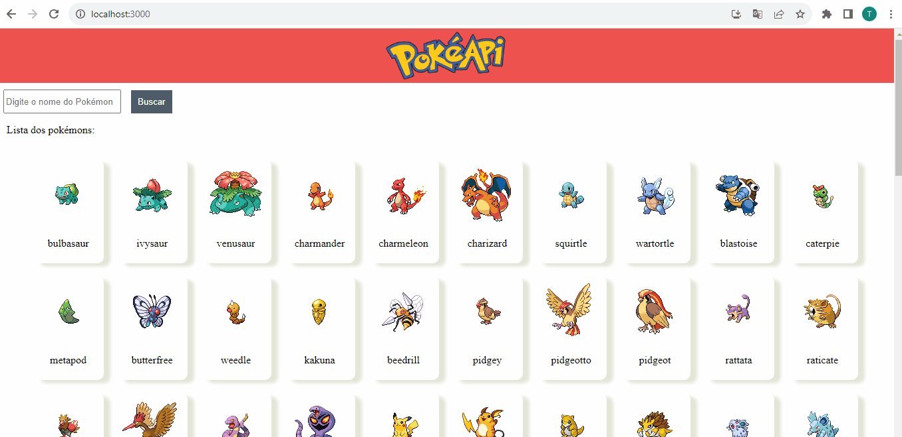

# Pokedex
A Pokedex é uma incrível ferramenta que reúne informações detalhadas sobre 80 Pokémon diferentes. Com esta aplicação interativa e dinâmica, você pode explorar as características de cada Pokémon, aprender sobre suas habilidades e até mesmo buscar por seus favoritos. A Pokedex possui um design responsivo, que se adapta perfeitamente a qualquer dispositivo, e campos validados para garantir uma experiência de usuário sem problemas.

## Instalação
1. Clone o repositório: git clone https://github.com/tobiasramos/pokedex.git
2. Acesse o diretório do projeto: cd pokedex
3. Instale as dependências: npm install

## Uso
1. Execute o projeto localmente: npm start
2. Abra o navegador e acesse: http://localhost:3000

## Tecnologias utilizadas
 - HTML
 - CSS
 - JAVASCRIPT
 - REACTJS

## Projeto em execução
